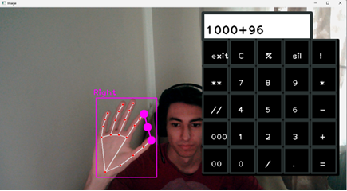

# OpenCv-ile-hesapmakinesi

Bu projemizin amacı kamera ile elimizi tanıtıp, ifade tanımlayıp, hesap makinesine elimiz ile komut girmektir.

## Kullanılan kütüphaneler:

-[opencv](https://pypi.org/project/opencv-python/)
-[cvzone](https://pypi.org/project/cvzone/)
-[pyttsx3](https://pypi.org/project/pyttsx3/)
-[mediapipe](https://pypi.org/project/mediapipe/)

## Nasıl Çalışır?

Baş parmağımız ve işaret parmağımızı birleştirince "bir tıklama" yapıyor. Sayıları belirlemeden işlem yapmaya çalışırsanız uygulama hata vericektir o yüzden kuralına göre işlemlerinizi yapınız. Bazı işlemlerde sesli komutlar bulunmaktadır. Ekstradan el ifadeleri tanımlanılmıştır. Bunları bulmayı size bırakıyorum :}

## Çalıştırırken hata verirse?

Projeyi çalıştırırken hata alırsanız, bunun kaynağı büyük ihtimalle kütüphanelerin sürümü ile python sürümünün çakışmasıdır. Ben bu projeyi yaparken python sürümüm 3.8.3 ve media pipe 0.9.0. 
Kütüphaneler ile ilgili hala hata alıyor olursanız kütüphanelerin sürümlerini düşürmeyi deneyin.

